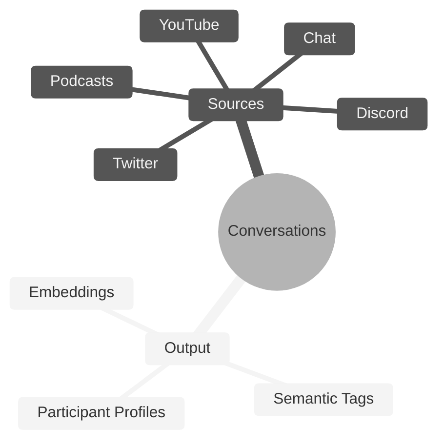

# README

## **Conversation Genome Project**

***

* [Conversation Genome Project](./#conversation-genome-project)
  * [Key Features](./#key-features)
  * [Benefits](./#benefits)
  * [System Design](./#system-design)
  * [Rewards and Incentives](./#rewards-and-incentives)
* [Getting Started](./#getting-started)
  * [Installation](./#installation)
  * [Quickstart Mock Tests](./#quickstart-mock-tests)
  * [Configuration](./#configuration)
  * [Registration](./#registration)
* [Subnet Roles](./#subnet-roles)
  * [Mining](./#mining)
  * [Validating](./#validating)
* [Helpful Guides](./#helpful-guides)
  * [Using Runpod](./#Using-Runpod)
  * [Managing Processes](./#Managing-Processes)
* [License](./#license)

***

## Introduction to the Conversation Genome Project

The Conversation Genome Project (CGP) is an open-source initiative aimed at enabling personalized conversational AI by providing a comprehensive dataset of indexed and tagged conversations.

If you are new to Bittensor, please checkout the [Bittensor Website](https://bittensor.com/) before proceeding to the setup section.


### Key Features

* Indexing and tagging of billions of conversations across various sources (YouTube, podcasts, etc.)
* Leveraging fractal data mining and conversation windows for efficient processing
* Synthetic participant profiles generated from conversation metadata
* Boring Index algorithm to assess conversation quality (relevance, engagement, novelty, coherence, and fluency)
* Open-source dataset for training and fine-tuning conversational AI models
* Incentivized mining and validation system for data contribution and integrity

***

## Getting Started

### Installation

This repository requires python3.{} or higher. To install it, simply clone this repository and install the dependencies:

```console
git clone https://github.com/afterpartyai/bittensor-afterparty-conversation-genome-subnet.git ap-cg-subnet
cd ap-cg-subnet
pip install -r requirements.txt
```

***

### Quickstart Mock Tests

The best way to begin to understand the Conversation Genome (CG) is to run the example test script. This script is meant to provide verbose output so you can see how the process works. It also executes against mock data sources and APIs so you don't need to have anything set up in terms of keys, etc. to see how this operates.

Run the command below to see the output:

```console
bash run_tests.sh
```

You can follow the output to see the miner executes the following flow:

* Validator reserves a conversation and generates full-conversation ground-truth tags
* Validator Divides conversation into windows, and sends a window to 3 different UIDs
* Miners generate tags on the window they are sent, generates embeddings for those tags, and sends back to validator
* Validator Scores tags and generates final scores for each miner on this step

***

### Configuration

Now that you've seen the process execute, let's configure your instance and run the tests that verify everything is setup properly.

First duplicate the dotenv file:

```console
cp env_example .env
```

Use your editor to add your settings. You will need a ChatGPT key and a Bittensor hotkey. If you're on a Linux box, the nano editor is usually the easiest:

```console
nano .env
```

***

### Registration

Before mining or validating, you will need a UID, which you can acquire by following documentation on the bittensor website [here](https://docs.bittensor.com/subnets/register-validate-mine).

To register on testnet, add the flag `--subtensor.network test` to your registration command, and specify `--netuid 138` which is our testnet subnet uid

***

## Subnet Roles

### Mining

You can launch your miners on testnet using the following command.

To run with pm2 please see instructions [below](./#pm2-installation-and-management)

If you are running on runpod, please read instructions [here](./#using-runpod)

```
python3 -m neurons.miner --subtensor.network test --netuid 138 --wallet.name <coldkey name> --wallet.hotkey <hotkey name> --logging.debug --axon.port <port id>
```

### Validating

You can launch your validator on testnet using the following command.

To run with pm2 please see instructions [below](./#pm2-installation-and-management)

If you are running on runpod, please read instructions [here](./#using-runpod)

```
python3 -m neurons.validator --subtensor.network test --netuid 138 --wallet.name <coldkey name> --wallet.hotkey <hotkey name> --logging.debug --axon.port <port ID>
```

***

## Helpful Guides

### Using Runpod

Runpod is a very helpful resource for easily launching and managing cloud GPU and CPU instances, however, there are several configuration settings that must be implemented both on Runpod and in your start command for the subnet.

#### Choosing an Instance (WIP)

To run the subnet code for CGP, you'll need either a GPU or a CPU, depending on your subnet role and configuration.

Miners using an OpenAI API Key, you will need a CPU with at least \_\_GB of Ram and \_\_GB of Disk Space. Runpod provides basic CPU units of different processing powers.

Miners using the out-of-the-box \_\_\_ LLM will need a GPU with at least \_\_GB of VRam and \_\_ of Disk Space. We recommend \_\_\_\_ and \_\_\_\_ models.

#### Configuring Your Instance

Runpod Instances are dockerized. As a result, there are tricky configurations with ports to be able to run processes over the network.

When you are launching your pod, and have selected your instance, click "Edit Template."

<figure><figcaption></figcaption></figure>

With the editing window open, you adjust your container disk space and/or volume diskspace to match the needs of your neuron, and you can expose additional ports. You will need to expose symmetrical TCP Ports, which requires you to specify non-standard ports >=70000 in the "Expose TCP ports" field. Add however many ports you will need (we recommend at least 2, or more if you want to run additional miners).

<figure><figcaption></figcaption></figure>

Now, you can deploy your instance. Once it is deployed, navigate to your pods, find the instance you just launched, click "Connect" and navigate to the "TCP Port Mappings" tab. here, you should see your Symmetrical TCP Port IDs.

<figure><figcaption><p>NOTE: Even though the port does not match the original values of 70000 and 70001, two symmetrical port mappings were created. These can be used for bittensor neurons</p></figcaption></figure>

#### Starting Your Neuron

**Important!!** You will need to add one of these ports to your start command for the neuron you are running, using the flag

`--axon.port <port ID>`

Every process will require a unique port, so if you run a second neuron, you will need a second Port ID. See below for an EXAMPLE Full start command

`enter start command here`

#### Running a Subtensor on Runpod

Unfortunately, there is no straight-forward or reliable way to run a local subtensor on a Runpod Instance. You can, however, leverage another cloud provider of your choice to run a Subtensor, and connect to that local subtensor using the `--subtensor.chain_endpoint <your chain endpoint>` flag in your neuron start command. For further information on running a local subtensor, please see the [Bittensor Docs](https://docs.bittensor.com/subtensor-nodes/).

***

### Managing Processes

While there are many options for managing your processes, we recommend either pm2 or Screen. Please see below for instructions on installing and running pm2

#### pm2 Installation and Management

To install Pm2 on your Ubuntu Device, use

```
apt install nodejs npm
npm install -g pm2
```

To run your process in pm2, use the following command format:

```
pm2 start "<your neuron start command here>" --name "<your process name here>"
```

Full example:

```
pm2 start "python3 -m neurons.miner --netuid 1 --wallet.name default --wallet.hotkey default --logging.debug --axon.port 40049" --name "miner"
```

The following Commands will be useful for management:

```
pm2 list # lists all pm2 processes
pm2 logs <pid> # replace pid with your process ID to view logs
pm2 restart <pid> # restart this pic
pm2 stop <pid> # stops your pid
pm2 del <pid> # deletes your pid
pm2 describe <pid> # prints out metadata on the process
```




## Conversation Genome Project Overview (continued)

### Benefits

* Addresses the lack of personalization in current conversational AI models
* Enables natural and engaging conversations tailored to individual contexts and preferences
* Provides a comprehensive and annotated dataset for conversational AI development
* Encourages open-source community contributions and advancements
* Maintains data integrity through validation and scoring mechanisms

### System Design

* Data stores: Primary source of truth, conversation windows, participant profiles, and vector database
* Validator roles: Pull data, ground conversations, create windows, and score submissions
* Miner roles: Process conversation windows, provide metadata and tags
* Data flow: Ground truth establishment, window creation, miner submissions, scoring, and validation

### Rewards and Incentives

* Miners rewarded for accurate and valuable metadata contributions
* Bell curve distribution of rewards to encourage high-quality submissions
* Cross-referencing and vector space analysis to ensure data integrity
* Boring Index algorithm for assessing conversation quality (not yet used for miner rewards)


### License

This repository is licensed under the MIT License.

```
# The MIT License (MIT)
# Copyright © 2024 Afterparty

# Permission is hereby granted, free of charge, to any person obtaining a copy of this software and associated
# documentation files (the “Software”), to deal in the Software without restriction, including without limitation
# the rights to use, copy, modify, merge, publish, distribute, sublicense, and/or sell copies of the Software,
# and to permit persons to whom the Software is furnished to do so, subject to the following conditions:

# The above copyright notice and this permission notice shall be included in all copies or substantial portions of
# the Software.

# THE SOFTWARE IS PROVIDED “AS IS”, WITHOUT WARRANTY OF ANY KIND, EXPRESS OR IMPLIED, INCLUDING BUT NOT LIMITED TO
# THE WARRANTIES OF MERCHANTABILITY, FITNESS FOR A PARTICULAR PURPOSE AND NONINFRINGEMENT. IN NO EVENT SHALL
# THE AUTHORS OR COPYRIGHT HOLDERS BE LIABLE FOR ANY CLAIM, DAMAGES OR OTHER LIABILITY, WHETHER IN AN ACTION
# OF CONTRACT, TORT OR OTHERWISE, ARISING FROM, OUT OF OR IN CONNECTION WITH THE SOFTWARE OR THE USE OR OTHER
# DEALINGS IN THE SOFTWARE.
```
