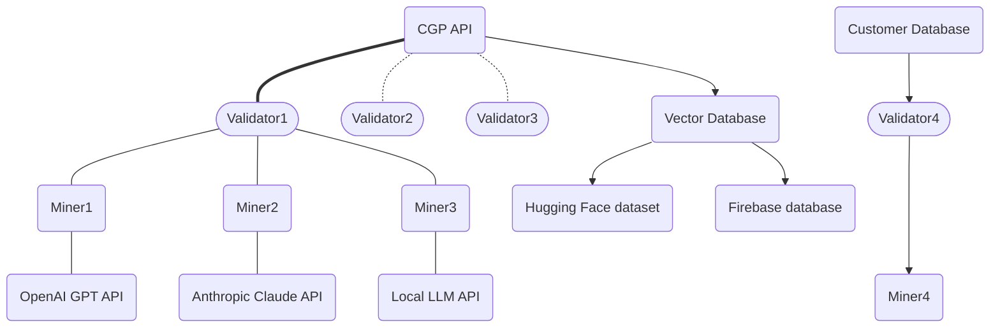
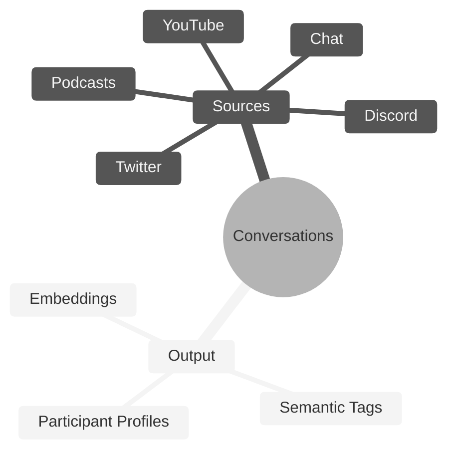

# **Conversation Genome Project** <!-- omit in toc -->
[](https://discord.gg/bittensor)
[](https://opensource.org/licenses/MIT)

---
- [Conversation Genome Project](#conversation-genome-project-overview)
  - [Key Features](#key-features)
  - [Benefits](#Benefits)
  - [System Design](#System-Design)
  - [Rewards and Incentives](#rewards-and-incentives)
- [Getting Started](#Getting-Started)
  - [Installation](#Installation-&-Compute-Requirements)
  - [Configuration](#configuration)
  - [Quickstart - Running the tests](#running-the-tests)
  - [Registration](#Registration)
- [Subnet Roles](#subnet-roles)
  - [Mining](#mining)
  - [Validating](#validating)
- [Helpful Guides](#helpful-guides)
  - [Runpod](#Runpod)
  - [Managing Processes](#managing-processes)
- [License](#license)

---

# Introduction to the Conversation Genome Project

The Conversation Genome Project (CGP) is an open-source initiative aimed at enabling personalized conversational AI by providing a comprehensive dataset of indexed and tagged conversations.

If you are new to Bittensor, please checkout the [Bittensor Website](https://bittensor.com/) before proceeding to the setup section.



## Key Features

- Indexing and tagging of billions of conversations across various sources (YouTube, podcasts, etc.)
- Leveraging fractal data mining and conversation windows for efficient and privacy-preserving processing
- Synthetic participant profiles generated from conversation metadata
- Algorithm to assess conversation quality (relevance, engagement, novelty, coherence, and fluency)
- Open-source dataset for training and fine-tuning conversational AI models
- Incentivized mining and validation system for data contribution and integrity


# Getting Started

## Installation & Compute Requirements

This repository requires python3.8 or higher. To install the subnet code, simply clone this repository and install the dependencies:

```console
git clone https://github.com/afterpartyai/bittensor-conversation-genome-project.git cgp-subnet
cd cgp-subnet
pip install -r requirements.txt
```

Miners & Validators using an OpenAI API Key will need a CPU with at least 8GB of Ram and 20GB of Disk Space.


## Quickstart Mock Tests

The best way to begin to understand the Conversation Genome Project (CGP) is to run the unit tests. These tests are meant to provide verbose output so you can see how the process works.

### Configuration

Let's configure your instance and run the tests that verify everything is setup properly.

You'll need to duplicate the dotenv file to setup your own configuration:

```console
cp env.example .env
```

Use your editor to add your Api keys for **Weights and Biases** and **OpenAI**.

If you're on a Linux box, the nano editor is usually the easiest:

```console
nano .env
```

Open the .env file in your editor and change these variables to your API keys:

```console
WANDB_API_KEY=some_key
OPENAI_API_KEY=some_key
```

The example file specifies the LLM type as **openai** and the model to use as **gpt-3.5-turbo**, but you can change it depending on your preferences.

### Running the Tests

Once this is setup, let's run the test validator suite, so you can watch the process at work:

```console
python -m pytest -s --disable-warnings  tests/test_validator_lib.py
```

You can follow the output to see the process executes the following flow:

- Starts a validator and three miners
- The validator:
  - Obtains a conversation to process from the CGP Api
  - Generates tags for the entire conversation
  - Breaks the conversation into conversation windows
  - Sends the first conversation window to 3 miners
- Each miner:
  - Receives the conversation window
  - Processes it through the LLM to generate tags, participant profiles, and vector embeddings for each semantic tag
  - Returns the metadata to the validor
- The validator:
  - Receives the metadata from the miners
  - Scores each tag against the ground truth full conversation
  - Compares each miner return against other miner returns
  - Pushes all the metadata to a local store or the CGP Api

The data generated is explained in detail in the Overview section below. With the Info logging setting, the output should look something like this:

```
- Reserved conversation ID: 1421. Sending to openai LLM... -
- Execute generate_full_convo_metadata for participants ['"SPEAKER_00"', '"SPEAKER_02"'] -
- Found 13 tags in FullConvo -
- Found 38 conversation windows. Sequentially sending to batches of miners -
- Send to conversation 1421 / 0 to miners: [2, 8, 1] -
- RESULTS from miner idx: 0 uid: 2, tags: 11 vector count: 11 -
- RESULTS from miner idx: 1 uid: 8, tags: 4 vector count: 4 -
- RESULTS from miner idx: 2 uid: 1, tags: 10 vector count: 10 -
- Scores num: 11 num of Unique tags: 10 num of full convo tags: 13 -
- Scores num: 4 num of Unique tags: 3 num of full convo tags: 13 -
- Scores num: 10 num of Unique tags: 8 num of full convo tags: 13 -
```


If you have any reported errors, check your **.env** and Python environment and run again until all tests are finished.

These tests run outside the Bittensor network (so no emissions), but they will get a test conversation, process it using your OpenAI key, and report the results. That will make sure the process itself is running properly on your machine.

If everything is working properly, you are ready to run against the testnet. Please see instructions in the [Registration](#Registration) section to register your hotkey and cold key on our testnet subnet.

Once you are registered, run `nano testnet_start_miner.sh` to edit the start command to the correct wallet information and any additional flags you wish to include, and run this file:

```console
bash testnet_start_miner.sh
```


## Registration
Before mining or validating, you will need a UID, which you can acquire by following documentation on the bittensor website here.

To register on testnet, add the flag `--subtensor.network test` to your registration command, and specify `--netuid 138` which is our testnet subnet uid.

To register on mainnet, you can speciy `--netuid 33` which is our mainnet subnet uid. 


# Subnet Roles

## Mining

You can launch your miners on testnet using the following command.

To run with pm2 please see instructions [here](#Running-a-Miner-with-PM2)

If you are running on runpod, please read instructions [here](#Using-Runpod).

```
python3 -m neurons.miner --subtensor.network test --netuid 138 --wallet.name <coldkey name> --wallet.hotkey <hotkey name> --logging.debug --axon.port <port>
```

Once you've registered on on mainnet SN33, you can start your miner with this command: 

```
python3 -m neurons.miner --netuid 33 --wallet.name <wallet name> --wallet.hotkey <hotkey name> --axon.port <port>
```


## Validating

You can launch your validator on testnet using the following command.

To run with pm2 please see instructions [here](#Running-a-Validator-with-PM2)

If you are running on runpod, please read instructions [here](#Using-Runpod)

```
python3 -m neurons.validator --subtensor.network test --netuid 138 --wallet.name <wallet name> --wallet.hotkey <hotkey name> --logging.debug --axon.port <port>
```

Once you've registered on on mainnet SN33, you can start your miner with this command: 

```
python3 -m neurons.validator --netuid 33 --wallet.name <wallet name> --wallet.hotkey <hotkey name> --axon.port <port>
```


# Helpful Guides

## Using Runpod

Runpod is a very helpful resource for easily launching and managing cloud GPU and CPU instances, however, there are several configuration settings that must be implemented both on Runpod and in your start command for the subnet.

### Choosing an Instance

To run the subnet code for CGP, you'll need either a GPU or a CPU, depending on your subnet role and configuration.

Miners & Validators using an OpenAI API Key, you will need a CPU with at least 8GB of Ram and 20GB of Disk Space. Runpod provides basic CPU units of different processing powers.

### Configuring Your Instance

Runpod Instances are dockerized. As a result, there are specific ports configurations needed to be able to run processes over the network.

When you are launching your pod, and have selected your instance, click "Edit Template."

With the editing window open, you adjust your container disk space and/or volume diskspace to match the needs of your neuron, and you can expose additional ports. You will need to expose symmetrical TCP Ports, which requires you to specify non-standard ports >=70000 in the "Expose TCP ports" field. Add however many ports you will need (we recommend at least 2, or more if you want to run additional miners).

Now, you can deploy your instance. Once it is deployed, navigate to your pods, find the instance you just launched, click "Connect" and navigate to the "TCP Port Mappings" tab. here, you should see your Symmetrical TCP Port IDs.

NOTE: Even though the port does not match the original values of 70000 and 70001, two symmetrical port mappings were created. These can be used for bittensor neurons

### Starting Your Neuron

*Important!!* You will need to add one of these ports to your start command for the neuron you are running, using the flag

`--axon.port <port ID>`

Every process will require a unique port, so if you run a second neuron, you will need a second Port ID.

### Running a Subtensor on Runpod

Unfortunately, there is no stable and reliable way to run a local subtensor on a Runpod Instance. You can, however, leverage another cloud provider of your choice to run a Subtensor, and connect to that local subtensor using the `--subtensor.chain_endpoint <your chain endpoint>` flag in your neuron start command. For further information on running a local subtensor, please see the [Bittensor Docs](https://docs.bittensor.com/subtensor-nodes/).

## Managing Processes

While there are many options for managing your processes, we recommend either pm2 or Screen. Please see below for instructions on installing and running pm2

### pm2 Installation

To install Pm2 on your Ubuntu Device, use

```
apt install nodejs npm
npm install -g pm2
```

The basic command structure to run a process in pm2 is below:

```
pm2 start "<your neuron start command here>" --name "<your process name here>"
```

### Running a Miner with PM2

To run a miner with PM2, you can use the following template:

```
pm2 start "python3 -m neurons.miner --netuid 33 --wallet.name default --wallet.hotkey default --logging.debug --axon.port <port>" --name "miner"
```

### Running a Validator with PM2

To run a validator with PM2, you can use the following template:

```
pm2 start "python3 -m neurons.validator --netuid 33 --wallet.name <wallet name> --wallet.hotkey <hotkey name> --axon.port <port>" --name "validator"
```

### Useful PM2 Commands

The following Commands will be useful for management:

```
pm2 list # lists all pm2 processes
pm2 logs <pid> # replace pid with your process ID to view logs
pm2 restart <pid> # restart this pic
pm2 stop <pid> # stops your pid
pm2 del <pid> # deletes your pid
pm2 describe <pid> # prints out metadata on the process
```


# Conversation Genome Project Overview

Conversation Genome Project (CGP) uses the Bittensor infrastructure to annotate data related to conversations.

## Benefits

- Addresses the lack of personalization in current conversational AI models
- Enables natural and engaging conversations tailored to individual contexts and preferences
- Provides a comprehensive and annotated dataset for conversational AI development
- Encourages open-source community contributions and advancements
- Maintains data integrity through validation and scoring mechanisms

## System Design

- Data stores: Primary source of truth, conversation windows, participant profiles, and vector database
- Validator roles: Pull data, generates overview metadata for ground conversations, create windows, and score submissions
- Miner roles: Process conversation windows, provide metadata and tags
- Data flow: Ground truth establishment, window creation, miner submissions, scoring, and validation

## Rewards and Incentives

- Miners rewarded for accurate and valuable metadata contributions
- Balanced distribution of rewards to encourage high-quality submissions
- Cross-referencing and vector embeddings analysis to ensure data integrity
- Algorithm for assessing conversation quality (not yet used for miner rewards)




## License
This repository is licensed under the MIT License.
```text
# The MIT License (MIT)
# Copyright © 2024 Conversation Genome Project

# Permission is hereby granted, free of charge, to any person obtaining a copy of this software and associated
# documentation files (the “Software”), to deal in the Software without restriction, including without limitation
# the rights to use, copy, modify, merge, publish, distribute, sublicense, and/or sell copies of the Software,
# and to permit persons to whom the Software is furnished to do so, subject to the following conditions:

# The above copyright notice and this permission notice shall be included in all copies or substantial portions of
# the Software.

# THE SOFTWARE IS PROVIDED “AS IS”, WITHOUT WARRANTY OF ANY KIND, EXPRESS OR IMPLIED, INCLUDING BUT NOT LIMITED TO
# THE WARRANTIES OF MERCHANTABILITY, FITNESS FOR A PARTICULAR PURPOSE AND NONINFRINGEMENT. IN NO EVENT SHALL
# THE AUTHORS OR COPYRIGHT HOLDERS BE LIABLE FOR ANY CLAIM, DAMAGES OR OTHER LIABILITY, WHETHER IN AN ACTION
# OF CONTRACT, TORT OR OTHERWISE, ARISING FROM, OUT OF OR IN CONNECTION WITH THE SOFTWARE OR THE USE OR OTHER
# DEALINGS IN THE SOFTWARE.
```
