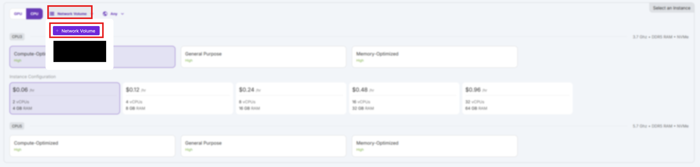
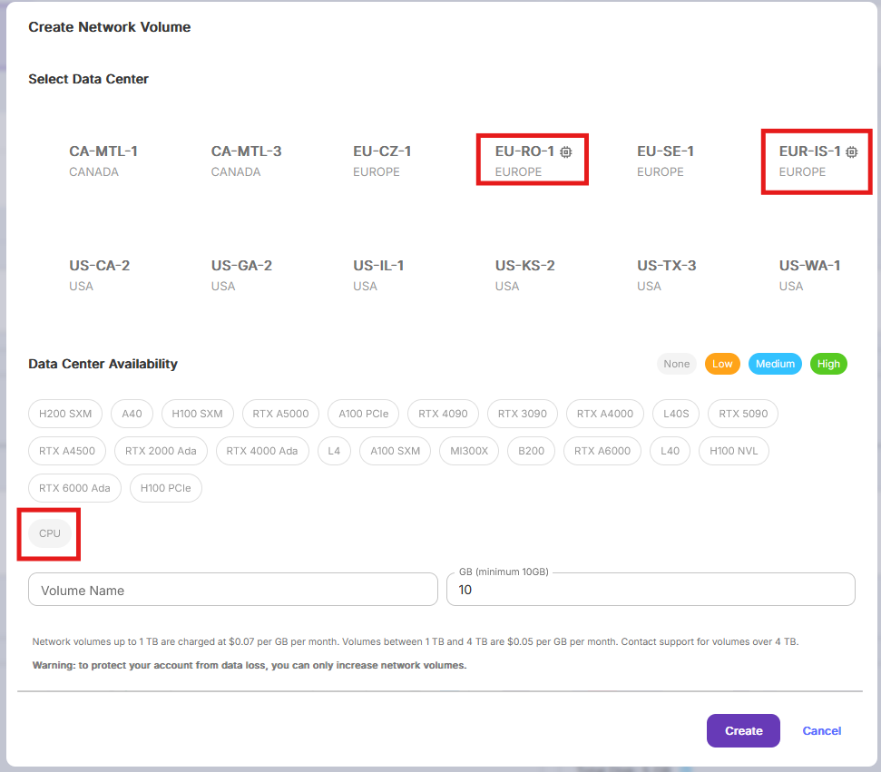
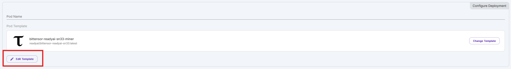
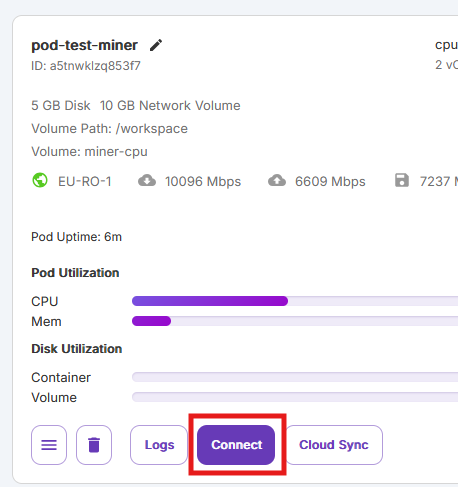
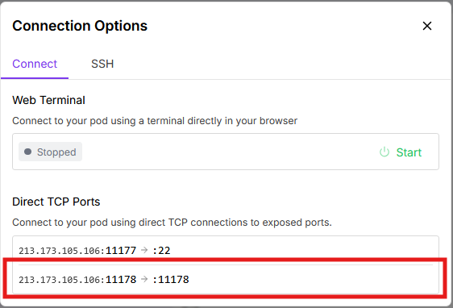
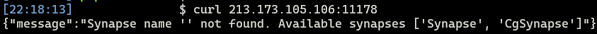
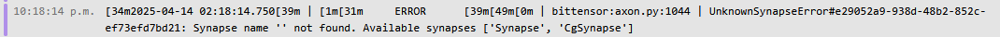
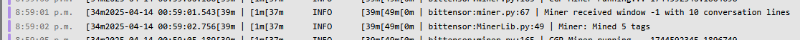
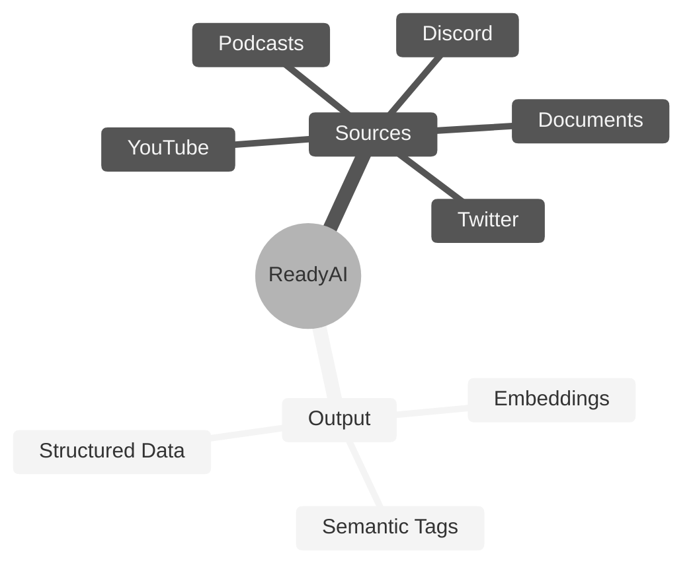

# **ReadyAI** <!-- omit in toc -->
[](https://discord.gg/bittensor)
[](https://opensource.org/licenses/MIT)

---
- [Conversation Genome Project](#conversation-genome-project-overview)
  - [Key Features](#key-features)
  - [Benefits](#Benefits)
  - [System Design](#System-Design)
  - [Rewards and Incentives](#reward-mechanism)
- [Getting Started](#Getting-Started)
  - [Installation & Compute Requirements](#installation--compute-requirements)
  - [Configuration](#configuration)
  - [LLM Selection](#LLM-Selection)
  - [Quickstart - Running the tests](#running-the-tests)
  - [Registration](#Registration)
  - [Get Running Quickly with the Docker Image!](#Running-a-Miner-or-a-Validator-with-Docker)
  - [Get a miner Running on Runpod](#Running-a-Miner-on-Runpod)
- [Subnet Roles](#subnet-roles)
  - [Mining](#mining)
  - [Validating](#validating)
- [Helpful Guides](#helpful-guides)
  - [Runpod](#Runpod)
  - [Managing Processes](#managing-processes)
  - [Making sure your port is open](#making-sure-your-port-is-open)
- [License](#license)

---

# Introduction to ReadyAI

ReadyAI is an open-source initiative aimed at provide a low-cost resource-minimal data structuring and semantic tagging pipeline for any individual or business. AI runs on Structured Data. ReadyAI is a low-cost, structured data pipeline to turn your raw data into structured data for your vector databases and AI applications.

If you are new to Bittensor, please checkout the [Bittensor Website](https://bittensor.com/) before proceeding to the setup section.


## Key Features

- Raw Data in, structured AI Ready Data out
- Fractal data mining allows miners to process a wide variety of data sources and create tagged, structured data for the end user’s specific needs
- Validators establish a ground truth by tagging the data in full, create data windows for fractal mining, and score miner submissions
- Scoring is based on a cosine distance calculation between the miner’s window tagged output and the validator’s ground truth tagged output
- ReadyAI has created a low-cost structured data pipeline capitalizing on two key innovations: (1) LLMs are now more accurate and cheaper than human annotators and (2) Distributed compute vs. distributed workers make this infinitely scalable
- Incentivized mining and validation system for data contribution and integrity


# Getting Started

## Installation & Compute Requirements

This repository requires Python version greater than 3.8 and up to 3.11. To get started, clone the repository and install the required dependencies:

```console
git clone https://github.com/afterpartyai/bittensor-conversation-genome-project.git cgp-subnet
cd cgp-subnet
pip install -r requirements.txt
```

Miners & Validators using an OpenAI API Key will need a CPU with at least 8GB of Ram and 20GB of Disk Space.


## Quickstart Mock Tests

The best way to begin to understand ReadyAI’s data pipeline is to run the unit tests. These tests are meant to provide verbose output so you can see how the process works.

### Configuration

Let's configure your instance and run the tests that verify everything is setup properly.

You'll need to duplicate the dotenv file to setup your own configuration:

```console
cp env.example .env
```

Use your editor to open the .env file, and follow instructions to enter the required API Keys and configurations. **An OpenAI API key is required by both miners and validators***. GPT-4o is the default LLM used for all operations, as it is the cheapest and most performant model accessible via API. Please see [LLM Selection](#LLM-Selection) Below for more information.

**A Weights and Biases Key is required by both miners and validators** as well.

**Please follow all instructions in the .env**

If you're on a Linux box, the nano editor is usually the easiest:

```console
nano .env
```

### LLM Selection

**Please follow all instructions in the .env**

LLM utilization is required in this subnet to annotate raw data. As a miner or validator, GPT-4o is the default LLM used for all operations. If you wish to override this default selection, you can follow override instructions below or in your `.env` file. After completing the steps in [Configuration](#Configuration), you can open up your `.env` file, and view the options. Currently, we offer out-of-the-box configuration for OpenAI, Anthropic, and groq APIs. 

To change the default OpenAI Model used by your miner or validator, you first must uncomment `LLM_TYPE_OVERRIDE=openai` and the select your model using the `OPENAI_MODEL` parameter in the .env:

```
# ____________ OpenAI Configuration: ________________
# OpenAI is the default LLM provider for all miner and validator operations, utilizing GPT-4o.
# To override your OpenAI model choice, uncomment the line below, then proceed to selecting a model. For other override options, see "Select LLM Override" below.
#export LLM_TYPE_OVERRIDE=openai

Enter a model below. See all options at: https://platform.openai.com/docs/models
#export OPENAI_MODEL=gpt-3.5-turbo
#export OPENAI_MODEL=gpt-4-turbo
```

If you wish to use a provider other than OpenAI, you select your LLM Override by uncommenting a line in this section of the .env:

```
# ____________ Select LLM Override________________
...
#export LLM_TYPE_OVERRIDE=groq
#export LLM_TYPE_OVERRIDE=anthropic
```

Please ensure you only have one `LLM_TYPE_OVERRIDE` config parameter uncommented before moving on. Once you have selected the `LLM_TYPE`, follow prompts in the .env file to fill in required fields for your override LLM provider.


### Running the Tests

Once you have finalized your configuration, you can run the miner loop test suite, which now exercises the entire flow (validator + miner). These tests use conversations from ReadyAI's test API or a local source and your OpenAI key, but they do not touch the Bittensor network.

First, set up a fresh virtual environment for running tests, and install the test requirements.
(These requirements differ from production; keep them separate from your normal `venv`.)

```console
python3 -m venv test_venv
source test_venv/bin/activate
pip install -r requirements_test.txt
```

**Miner Loop Test**

Run the miner loop test:

```console
python -m pytest -s --disable-warnings tests/test_full_loop.py
```

This test will:
- Start a validator
- Obtain a test conversation from the ReadyAI API (or from your local API if configured)
  - Details on how to use a local api are [here](#for-testing-with-a-local-api)
- Generate ground-truth tags
- Break the conversation into windows
- Behave like 3 miners
- Send conversation windows to the miners
- Each miner:
  - Processes the window with the LLM
  - Generates tags, annotations, and embeddings
  - Returns metadata to the validator
- The validator:
  - Receives metadata
  - Scores tags against the full ground truth
  - Pushes metadata into the store

You’ll see detailed logs of scoring and metadata evaluation. Example output is shown below.

```console
2025-08-21 14:09:38.494 |       INFO       | bittensor:validator.py:119 | Looping for piece 1 out of 41
2025-08-21 14:09:38.494 |       INFO       | bittensor:ValidatorLib.py:196 | Execute generate_full_convo_metadata
2025-08-21 14:09:43.454 |       INFO       | bittensor:ValidatorLib.py:137 | Found 13 tags and 12 in FullConvo
2025-08-21 14:09:44.362 |      DEBUG       | bittensor:WandbLib.py:163 | Weights and Biases Logging Disabled -- Skipping Log
2025-08-21 14:09:44.363 |       INFO       | bittensor:validator.py:193 | miner_uid pool [0]
2025-08-21 14:09:44.363 |       INFO       | bittensor:validator.py:195 | Sending convo window 1 of 10 lines to miners...
2025-08-21 14:09:44.363 |       INFO       | bittensor:miner.py:68 | Miner received window -1 with 10 conversation lines
2025-08-21 14:09:45.386 |       INFO       | bittensor:MinerLib.py:50 | Miner: Mined 8 tags
2025-08-21 14:09:48.381 |      DEBUG       | bittensor:validator.py:267 | GOOD RESPONSE: hotkey: miner1 from miner response idx: 0 window idx: 1 tags: 7 vector count: 7 original tags: 8
2025-08-21 14:09:49.102 |       INFO       | bittensor:evaluator.py:272 | Scores num: 7 num of Unique tags: 7 num of full convo tags: 13
TEST MODE: 1 responses received for window 1 with 1 final scores
2025-08-21 14:09:49.109 |      DEBUG       | bittensor:evaluator.py:87 | !!PENALTY: No BOTH tags
No metadata cached for None. Processing metadata...
2025-08-21 14:09:49.109 |      DEBUG       | bittensor:evaluator.py:211 | _______ ADJ SCORE: 0.3791243943790212 ___Num Tags: 7 Unique Tag Scores: [np.float64(0.30457485422248426), np.float64(0.37611637113991164), np.float64(0.2997473136583953), np.float64(0.40821129457030414), np.float64(0.288824040754252), np.float64(0.38571766406402447), np.float64(0.36922820699086023)] Median score: 0.36922820699086023 Mean score: 0.347488535057176 Top 3 Mean: 0.3900151099247468 Min: 0.288824040754252 Max: 0.40821129457030414
2025-08-21 14:09:49.110 |      DEBUG       | bittensor:evaluator.py:213 | Complete evaluation. Final scores:
[ { 'adjustedScore': np.float64(0.3791243943790212),
    'final_miner_score': np.float64(0.34121195494111906),
    'hotkey': 'miner1',
    'uid': 1,
    'uuid': 'miner1_id'}]
2025-08-21 14:09:49.110 |       INFO       | bittensor:validator.py:291 | Initial status codes: {200: 1}
2025-08-21 14:09:49.110 |       INFO       | bittensor:validator.py:292 | Final status codes: {200: 1}
2025-08-21 14:09:49.110 |      DEBUG       | bittensor:WandbLib.py:163 | Weights and Biases Logging Disabled -- Skipping Log
2025-08-21 14:09:49.111 |      DEBUG       | bittensor:ValidatorLib.py:270 | Scattered rewards: [0.34121194]
2025-08-21 14:09:49.111 |      DEBUG       | bittensor:validator.py:366 | Updated final scores: [1. 0. 0.]
```

**Notes**
- These tests run outside the Bittensor network (so no emissions).
- They require your OpenAI key in `.env`.
- The Api hosts and ports used in the tests come from the `.env` too.
  - Check in the [according section](#for-testing-with-a-local-api) for more details
- If you see errors, check your `.env` and Python environment and re-run.

Once the test passes and you’re ready to connect to the testnet. Please see Registration

#### For testing with a local API

If you want to use the local API instead, you need to follow the steps [here](#-running-the-conversation-server-locally)


Then modify the `.env` to point at the web server. Comment out the lines: 

```
#export CGP_API_READ_HOST=https://api.conversations.xyz
#export CGP_API_READ_PORT=443

#export CGP_API_WRITE_HOST=https://db.conversations.xyz
#export CGP_API_WRITE_PORT=443
```

Uncomment the lines: 
```
export CGP_API_READ_HOST=http://localhost
export CGP_API_READ_PORT=$LOCAL_CGP_API_PORT

export CGP_API_WRITE_HOST=http://localhost
export CGP_API_WRITE_PORT=$LOCAL_CGP_API_PORT
```
If you want your run to be uploaded to WandB, set `WAND_ENABLED=1`

After these changes, the `DB Read/Write Configuration` section of the .env file should look like this:

```console
# ____________ DB Read/Write Configuration: ____________
# For Validators. Read from api.conversations.xyz
#export CGP_API_READ_HOST=https://api.conversations.xyz
#export CGP_API_READ_PORT=443

# For Validators. Write to db.conversations.xyz
#export CGP_API_WRITE_HOST=https://db.conversations.xyz
#export CGP_API_WRITE_PORT=443

# For Validators. Used for local DB Configuration
# If you want to run a local API you can adjust the following variables:
export START_LOCAL_CGP_API=false
export LOCAL_CGP_API_PORT=8000

# You will also need to uncomment lines below
# See "Validating with a Custom Conversation Server" in the Readme.md for further information
export CGP_API_READ_HOST=http://localhost
export CGP_API_READ_PORT=$LOCAL_CGP_API_PORT

# Only uncomment this for local testing
export CGP_API_WRITE_HOST=http://localhost
export CGP_API_WRITE_PORT=$LOCAL_CGP_API_PORT
```

Now you can run the test script and see the data written properly (replace the filename with your database file).

```console
sqlite3 cgp_tags_YYYY.MM.DD.sqlite
.tables
SELECT id, c_guid, mode, llm_type, model FROM cgp_results LIMIT 10;
```

Or from the Docker:
```console
> docker ps
  - It will return your running Dockers find your Docker ID (The name contains: cgp_miner-1)

> docker exec DOCKER_ID ls web/ | grep cgp_tags 
  - It will return the list of the tables (Ex: cgp_tags_2025.05.08.sqlite)

> docker exec -it DOCKER_ID sqlite3 web/TAGS_TABLE_NAME.sqlite
  - Will start an interactive sqlite3 session that you can query as you wish!
  - You can run: SELECT id, c_guid, mode, llm_type, model FROM cgp_results LIMIT 10;
```

That will provide some of the data inserted into the results table.

#### API Metrics
The API exposes a `/metrics` endpoint that you can scrape with Prometheus to have information about the usage of your API.

By default, the basic metrics are exposed, but there is also a custom one:

- **api_requests_total** is a counter that is increased everytime a requests is received. It is labeled with the `api_key`, `ip`, `path` and `status` of the request.

Feel free to add more and open a PR. If they help you they will help someone else!

To scrape the metric endpoint of the API with a local Prometheus deployment, add this to your `scrape_configs`:
```yaml
- job_name: 'conversations_api'
  static_configs:
    - targets: ['localhost:8000']
```
If you host it somewhere else, adjust the target to use your specific ip and port combination.

## Registration
Before mining or validating, you will need a UID, which you can acquire by following documentation on the bittensor website here.

To register on testnet, add the flag `--subtensor.network test` to your registration command, and specify `--netuid 138` which is our testnet subnet uid.

To register on mainnet, you can speciy `--netuid 33` which is our mainnet subnet uid.


# Subnet Roles

## Mining

You can launch your miners on testnet using the following command.

To run with pm2 please see instructions [here](#Running-a-Miner-with-PM2)

If you are running on runpod, please read instructions [here](#Using-Runpod).

To setup and run a miner with Docker, see instructions [here](#Running-a-Miner-or-a-Validator-with-Docker).

```
python3 -m neurons.miner --subtensor.network test --netuid 138 --wallet.name <coldkey name> --wallet.hotkey <hotkey name> --logging.debug --axon.port <port>
```

Once you've registered on on mainnet SN33, you can start your miner with this command:

```
python3 -m neurons.miner --netuid 33 --wallet.name <wallet name> --wallet.hotkey <hotkey name> --axon.port <port>
```


## Validating

To run a validator, you will first need to generate a ReadyAI Conversation Server API Key. Please see the guide [here](docs/generate-validator-api-key.md). If you wish to validate via local datastore, please see the section below on [Validating with a Custom Conversation Server](#validating-with-a-custom-conversation-server)

You can launch your validator on testnet using the following command.

To run with pm2 please see instructions [here](#Running-a-Validator-with-PM2)

If you are running on runpod, please read instructions [here](#Using-Runpod)

To setup and run a validator with Docker, see instructions [here](#Running-a-Miner-or-a-Validator-with-Docker).


```
python3 -m neurons.validator --subtensor.network test --netuid 138 --wallet.name <wallet name> --wallet.hotkey <hotkey name> --logging.debug --axon.port <port>
```

Once you've registered on on mainnet SN33, you can start your miner with this command:

```
python3 -m neurons.validator --netuid 33 --wallet.name <wallet name> --wallet.hotkey <hotkey name> --axon.port <port>
```

## Validating with a Custom Conversation Server

Validators, by default, access the ReadyAI API to retrieve conversations and store results. However, the subnet is designed to be a decentralized “Scale AI” where each validator can sell access to their bandwidth for structuring raw data. The validator can run against any of its own data sources and process custom or even proprietary data.

> Make sure the raw data source is reasonably large. We recommend 50,000 input items at a minimum to prevent miners re-using previous results.


### The Code

In the web/ folder, you will find a sample implementation of a Custom Server setup. You will want to modify this server for your own needs.

The relevant code files in the web/ folder include:

- `readyai_conversation_data_importer.py` -- An example processor that reads [ReadyAi/5000-podcast-conversations-with-metadata-and-embedding-dataset](https://huggingface.co/datasets/ReadyAi/5000-podcast-conversations-with-metadata-and-embedding-dataset) and processes a subset of it and inserts it into the `conversations.sqlite` data store
- `facebook_conversation_data_importer.py` -- An example processor that reads the subset of the Facebook conversation data and processes it into the `conversations.sqlite` data store
- `app.py` -- A FastAPI-based web server that provides both the read and write endpoints for conversation server.

Data files include:

- `facebook-chat-data_2000rows.csv` -- A 128 conversation subset of the Facebook conversation data (full data available here: https://www.kaggle.com/datasets/atharvjairath/personachat/data)

Additional files included:

- `start_conversation_store.sh` -- Convenient bash file to start the server

### Converting the Example Data

Install dependencies and navigate to the proper folder:
```console
cd web/
pip install -r requirements.txt
```

Now you will run the data importer script:Sqlite database:
```console
python readyai_conversation_data_importer.py
```

This will download the training data from [ReadyAi/5000-podcast-conversations-with-metadata-and-embedding-dataset](https://huggingface.co/datasets/ReadyAi/5000-podcast-conversations-with-metadata-and-embedding-dataset) and insert the conversations into the `conversations.sqlite` database. If you delete the `conversations.sqlite` then it will create a new one and insert the data. 
  - You can also use `facebook_conversation_data_importer.py` if you want another dataset!

After launching the command, should see progress like this:
```console
21:55:22 Loading Hugging Face dataset: ReadyAi/5000-podcast-conversations-with-metadata-and-embedding-dataset
21:55:23 Dataset loaded. Total rows: 4888
21:55:23 Committing 100 rows...
21:55:23 Committing 200 rows...
21:55:24 Committing 300 rows...
21:55:24 Committing 400 rows...
21:55:24 Committing 500 rows...
21:55:24 Committing 600 rows...
21:55:25 Committing 700 rows...
21:55:25 Committing 800 rows...
21:55:25 Committing 900 rows...
21:55:26 Committing 1000 rows...
21:55:26 Committing 1100 rows...
21:55:27 Committing 1200 rows...
21:55:27 Done. Inserted 1200 rows.
```

If you have `sqlite3` installed, you can open the database file and see the inserted data like like:

```console
sqlite3 conversations.sqlite
.tables
SELECT * FROM conversations LIMIT 1;
```

That will show you the tables in the database (only 1 -- `conversations`) and then you will see one of the conversations like this:

```console
1|1|123|10000||{"id": 10000, "guid": 123, "lines": [[0, "Hey, Jordan Harbinger here from the Art of Charm."], [0, "Welcome to Minnesota Monday."], [0, "I m happy to be here with you kicking off the w...}|2025-04-30 21:54:16|2025-04-30 21:54:16
```

With the data populated, you're ready to start running the server.

> *Important:* Do not run your validator against this example dataset on mainnet. Please use a custom dataset of at least 50,000 raw data sources at a minimum to prevent miners from re-using previous results. Modify this script to process and load the data from a more robust data store that you've selected.

### 🚀 Running the Conversation Server Locally

#### Using the Prebuilt Docker Image

This section shows you how to quickly run the API server using a prebuilt Docker image—**no build step required**!

The image comes preloaded with a `conversations.sqlite` database containing **4,888 podcast conversations** ready for training or testing.

**Steps**

1. **Create Your `.env` File**

   Copy the example environment file and create your own configuration:  
   ```
   cp env.example .env
   ```

2. **Configure the Environment**

   Open the `.env` file and set the `TYPE` variable to `api`:  
   ```
   TYPE=api
   ```
   You will also need to adjust the endpoints for your needs as explained [here](#for-testing-with-a-local-api)

   > [!IMPORTANT]  
   > **If you are a validator** and you want to use the local api and test dataset to send conversations to miners, you have to set `TYPE=validator` and `START_LOCAL_CGP_API=true` instead


3. **Start the Server**

   Run the following script to launch the server:  
   ```
   mot/up
   ```

   This will:
   - Download the Docker image if not already present
   - Start the API using Docker Compose

   **To build the image yourself** instead of using the prebuilt one:  
   ```
   docker compose build  
   docker compose up
   ```

**Verifying the Server**

If the server starts correctly, your logs should show something like:  
```
cgp_miner-1  | INFO:     Started server process [7]  
cgp_miner-1  | INFO:     Waiting for application startup.  
cgp_miner-1  | INFO:     Application startup complete.  
cgp_miner-1  | INFO:     Uvicorn running on http://0.0.0.0:8000 (Press CTRL+C to quit)
```

**Test the API**

Make a test request to verify it’s running:  
```
curl -X POST localhost:8000/api/v1/conversation/reserve
```

Expected output:  
```
{"guid":11388,"lines":[[1,"Welcome to the Sell or Die podcast."],[1,"I...
```

#### From the Python Code 
This section will walk you through how to get the server up and running from the available Python code.

To get the server up and running, you can use the bash file:

```console
bash start_conversation_store.sh
```

To run this in pm2, please following installation instructions [here](#pm2-Installation) and then use the command

```console
pm2 start "bash start_conversation_store.sh" --name <process name>
```
---
> *Important:* By default, the API will return random conversations from the database. If you want it to return a specific conversation for testing purposes, you can adjust the endpoint in the API file: `web/app.py`.
  - You just have to comment the following line: `conversation = db.get_random_conversation()`
  - Uncomment this one: `# conversation = db.get_conversation(c_guid="123412")`
  - Pass the `c_guid` of the conversation you want the API to always return.

# Helpful Guides

## Using Runpod

Runpod is a very helpful resource for easily launching and managing cloud GPU and CPU instances, however, there are several configuration settings that must be implemented both on Runpod and in your start command for the subnet.

### Choosing an Instance

To run the subnet code for ReadyAI, you'll need either a GPU or a CPU, depending on your subnet role and configuration.

Miners & Validators using an OpenAI API Key, you will need a CPU with at least 8GB of Ram and 20GB of Disk Space. Runpod provides basic CPU units of different processing powers.

### Configuring Your Instance

Runpod Instances are dockerized. As a result, there are specific ports configurations needed to be able to run processes over the network.

When you are launching your pod, and have selected your instance, click "Edit Template."

With the editing window open, you adjust your container disk space and/or volume diskspace to match the needs of your neuron, and you can expose additional ports. You will need to expose symmetrical TCP Ports, which requires you to specify non-standard ports >=70000 in the "Expose TCP ports" field. Add however many ports you will need (we recommend at least 2, or more if you want to run additional miners).

Now, you can deploy your instance. Once it is deployed, navigate to your pods, find the instance you just launched, click "Connect" and navigate to the "TCP Port Mappings" tab. here, you should see your Symmetrical TCP Port IDs.

NOTE: Even though the port does not match the original values of 70000 and 70001, two symmetrical port mappings were created. These can be used for bittensor neurons

### Starting Your Neuron

*Important!!* You will need to add one of these ports to your start command for the neuron you are running, using the flag

`--axon.port <port ID>`

Every process will require a unique port, so if you run a second neuron, you will need a second Port ID.

### Running a Subtensor on Runpod

Unfortunately, there is no stable and reliable way to run a local subtensor on a Runpod Instance. You can, however, leverage another cloud provider of your choice to run a Subtensor, and connect to that local subtensor using the `--subtensor.chain_endpoint <your chain endpoint>` flag in your neuron start command. For further information on running a local subtensor, please see the [Bittensor Docs](https://docs.bittensor.com/subtensor-nodes/).

## Managing Processes

While there are many options for managing your processes, we recommend either pm2 or Screen. Please see below for instructions on installing and running pm2

## Making sure your port is open

For nodes to talk together properly, it's imperative the ports they use are open to communication. Miner/Validator communication is done via HTTP, therefore you have to ensure your node can receive that type of traffic on the port you serve in your Axon.

Example: If your axon is served on `123.123.123.123:22222`, you must ensure HTTP traffic works on port `22222`.

To easily validate if the port is open and receives traffic, you can do the following:

1. Get on the machine you want to validate the port on
2. Start a temporary Python HTTP server on the specified port using the following command:
```bash
python -m http.server 22222
```
3. If you see this, it worked!
```bash
Serving HTTP on 0.0.0.0 port 22222 (http://0.0.0.0:22222/) ...
```
4. Test connectivity from another machine by running: 
```bash
curl 123.123.123.123:22222
```
4. Check the response:
  - If you see incoming requests in the terminal of the server machine, the port is open and functioning correctly.
  ```bash
  TEST_SERVER_IP - - [28/Mar/2025 01:19:25] "GET / HTTP/1.1" 200 -
  ```
  - If no request appears, the traffic is being blocked. You may need to investigate firewall settings, network rules, or port forwarding configurations.
  
### pm2 Installation

To install Pm2 on your Ubuntu Device, use

```
apt install nodejs npm
npm install -g pm2
```

The basic command structure to run a process in pm2 is below:

```
pm2 start "<your neuron start command here>" --name "<your process name here>"
```

### Running a Miner with PM2

To run a miner with PM2, you can use the following template:

```
pm2 start "python3 -m neurons.miner --netuid 33 --wallet.name default --wallet.hotkey default --logging.debug --axon.port <port>" --name "miner"
```

### Running a Validator with PM2

To run a validator with PM2, you can use the following template:

```
pm2 start "python3 -m neurons.validator --netuid 33 --wallet.name <wallet name> --wallet.hotkey <hotkey name> --axon.port <port>" --name "validator"
```

### Useful PM2 Commands

The following Commands will be useful for management:

```
pm2 list # lists all pm2 processes
pm2 logs <pid> # replace pid with your process ID to view logs
pm2 restart <pid> # restart this pic
pm2 stop <pid> # stops your pid
pm2 del <pid> # deletes your pid
pm2 describe <pid> # prints out metadata on the process
```

## Running a Miner or a Validator with Docker  

### Requirements

- An [OpenAI API Key](https://platform.openai.com/api-keys)
- A [Bittensor wallet](https://docs.bittensor.com/working-with-keys#creating-a-wallet-with-btcli)
- [Registering](https://docs.bittensor.com/miners/#miner-registration) the hotkey on the subnet 33 
  - or 138 if you want to run on the test network

### Getting up and running

Follow these steps to set up and run a **miner** or **validator** using Docker:  

#### 1. Configure Your Wallet  
Ensure that your **coldkey** and **hotkey** are properly set up on the machine you intend to use. These should be stored in:  

```bash
~/home/.bitensor/wallets
```
- It is best practices when you regenerate your coldkey on a machine to mine or validate, to regenerate only the public coldkey using the following command: `btcli w regen-coldkeypub`

#### 2. Set Up Environment Variables  
At the root of the repository, create a copy of the environment variables file:  

```bash
cp env.example .env
```

#### 3. Update Configuration  
Modify the `.env` file to include your specific values and ensure all required fields are set:  

```bash
export COLDKEY_NAME=default  # Name of your Coldkey  
export HOTKEY_NAME=default   # Name of your Hotkey  
export TYPE=miner|validator  # Type of node to run ("miner" for mining, "validator" for validating)  

export NETWORK=finney|test   # Network to deploy the node (options: finney or test)  
export PORT=60000            # Axon service port  
export IP=0.0.0.0            # Axon service IP -- If not changed, will be set to your node's public IP

export OPENAI_API_KEY=       # Your OpenAI API Key

# --- For Validators ---
export WANDB_API_KEY=        # Your WandB API Key
export WAND_ENABLED=0        # Enable or disable WandB (Validators NEED to set this to 1)
```

- Do not forget to set your OpenAI API Key
- Set `TYPE=miner` to run a miner, or `TYPE=validator` to run a validator.
- Set `NETWORK=finney` to run on the main net, or `NETWORK=test` to run on the test net.
- Don't forget the port you chose has to be open and be able to receive HTTP requests. To validate follow the steps [here](#making-sure-your-port-is-open).
- ***If you are a validator:***
  - Do not forget to set your `WANDB_API_KEY` and to set `WAND_ENABLED` to 1
  - **On Finney**, do not forget to setup your ReadyAI API key by following the steps [here](https://github.com/afterpartyai/bittensor-conversation-genome-project/blob/main/docs/generate-validator-api-key.md) and make sure you have a file called `readyai_api_data.json` containing your API key.
  - **On Test net**, rename the provided API key in the root of the repository from `testnet_readyai_api_data.json` to `readyai_api_data.json` using `cp testnet_readyai_api_data.json readyai_api_data.json`. It will be pre-loaded in the Docker automaticaly.

#### 4. Start the Node  
Once the configuration is complete, start the node using:  

```bash
docker compose up -d
```

#### 5. Monitor Logs  
To check the node logs:  

1. List running containers:  
   ```bash
   docker ps
   ```  
2. Find the **CONTAINER ID** of your node.  
3. Stream the logs:  
   ```bash
   docker logs CONTAINER_ID --follow
   ```  

This setup ensures that your miner or validator runs smoothly within a Docker environment. 🚀


## How to Run a Bittensor Miner on Subnet 33 Using Runpod

This guide walks you through the process of deploying a Bittensor miner on Subnet 33 using [Runpod](https://runpod.io). In a few simple steps, you’ll go from zero to mining on the testnet or mainnet.

---

## ✅ Requirements

- A [Runpod.io](https://runpod.io) account  
- An OpenAI API key

---

## 🔐 Generate Your SSH Key

You’ll use SSH to access your miner. On your local machine, run the following:

```
ssh-keygen -t ed25519 -C "your_email@example.com"
```

Then, add your key to the SSH agent:

```
eval "$(ssh-agent -s)"  
ssh-add ~/.ssh/id_ed25519
```

---

## 🚀 Deploy the Pod on Runpod

1. **Click the template link to start deploying**  
   👉 [Launch Template](https://runpod.io/console/deploy?template=z1cctk4sdl&ref=fgpcs8kw)

2. **Create a Network Volume**  
    
   This is your miner’s persistent storage.
   - Choose a data center with available CPU instances.
      
   - Set a volume name and allocate 10 GB (enough for typical usage).

   > ✅ Tip: Make sure the volume is selected before creating the pod.

3. **Choose a Pod Configuration**  
   - Select the cheapest available CPU option — it’s sufficient for this subnet.

4. **Edit the Template and Set Environment Variables**
  

    | Variable         | Value                                                                 |
    |------------------|-----------------------------------------------------------------------|
    | `NETWORK`        | Use `test` for testnet or `finney` for mainnet.                      |
    | `OPENAI_API_KEY` | Create a Runpod secret named `openai_key` containing your API key.   |
    | `SSH_PUBLIC_KEY` | Paste the contents of your public SSH key (Usually in: `~/.ssh/id_ed25519.pub`). |

---

## 🧳 First Boot: Create Your Wallet

Once the pod starts, it will download the Docker image and initialize. You’ll see an error if your wallet isn't yet created — that's expected.

### Connect via SSH

In your pod's **Connect** section, you'll find the SSH command to access the miner. Use that to SSH in:

```
ssh -i ~/.ssh/id_ed25519 root@<YOUR_POD_IP>
```

### Create Your Wallet (if you don’t already have one) or recreate your wallet if you do!

> Your wallet must be in `/workspace/wallets` in order be picked up by the miner and be persisted.

#### Option 1: Create your wallet

We will create both the hotkey and coldkey at the same time:
```
cd /workspace  
mkdir wallets  
cd wallets  
btcli w create --wallet.path .
```

> 🔒 **IMPORTANT**: Backup your wallet to your local machine using `scp`:

```
scp -r root@<YOUR_POD_IP>:/workspace/wallets ./wallets
```

#### Option 2: Recreate your wallet

First recreate your public coldkey:

```
cd /workspace
mkdir wallets
cd wallets
btcli w regen-coldkeypub --wallet.path .
```

Then recreate your hotkey:

```
btcli w regen-coldkeypub --wallet.path .
```

---

## 🌍 Make Sure Your Miner is Reachable

Validators need to be able to reach your miner's Axon port.

1. Click **Connect** on your pod.
    
2. Note the **Direct TCP** port (not port 22). This is your Axon port and **must** be publicly accessible.
    

To test if it's reachable:

```
curl <YOUR_POD_IP>:<AXON_PORT>
```

You should:
- Get a JSON-like response in your terminal
    
- See logs in your miner indicating it received a connection
    

---

## 🔑 Registering your miner

You will need:
- Enough Tao to pay the registration fee

You can register by following these steps:
1. Connect via SSH into your miner as explained [here](#Connect-via-SSH)
2. Run the following command and complete the prompts:
```
btcli s register --netuid 138 --wallet.name default --wallet.hotkey default --network test --wallet.path /workspace/wallets
```

You can change the `--netuid` to `33` and the `--network` to `finney` if you want to register on the main Bittensor network

---

## 🎉 Your Miner Is Live!

You should now see logs indicating that the miner is running and active. When it actually handles validator requests, you will see logs like this:

> It can take up to 1 hour before validators send requests to your miner.

---

## 📌 Final Notes

- If you're using testnet, you can get TAO from the faucet.
- Keep an eye on your pod’s logs to monitor performance and connection health.
- Don’t forget to monitor your wallet, especially if you're switching to mainnet!

# ReadyAI Overview

ReadyAI uses the Bittensor infrastructure to annotate raw data creating structured data, the “oil” required by AI Applications to operate.

## Benefits

- Cost-efficiency: Our validators can generate structured data from any arbitrary raw text data. ReadyAI provides a cost-efficient pipeline for the processing of unstructured data into the valuable digital commodity of structured data.
- Quality: By using advanced language models and built-in quality control via the incentive mechanism arbitrated by validation, we can achieve more consistent, higher-quality annotations compared to crowd workers.
- Speed: AI-powered annotation can process data orders of magnitude faster than human annotators.
- Flexibility: The decentralized nature of our system allows it to rapidly scale and adapt to new task types. Validators can independently sell access to this data generation pipeline to process any type of text-based data (e.g. conversational transcript, corporate documents, web scraped data, etc.)
- Specialized knowledge: Unlike general-purpose crowd workers, our AI models can be fine-tuned on domain-specific data, allowing for high-quality annotations on specialized topics.

## System Design

- Data stores: Primary source of truth, fractal data windows, and vector embedding creation
- Validator roles: Pull data, generates overview metadata for data ground truth, create windows, and score submissions
- Miner roles: Process data windows, provide metadata and annotations
- Data flow: Ground truth establishment, window creation, miner submissions, scoring, and validation

## Reward Mechanism

The reward mechanism for the ReadyAI subnet is designed to incentivize miners to contribute accurate and valuable metadata to the ReadyAI dataset. Three miners are selected by a validator to receive the same Data Window, which is pulled from a larger raw data source. After they generate a set of tags for their assigned window, miners are rewarded based on the quality and relevance of their tags, as evaluated by validators against the set of tags for the full, ground truth data source.

A score for each miner-submitted tag is derived by a cosine distance calculation from the embedding of that tag to the vector neighborhood of the ground truth tags. The set of miner tags is then evaluated in full based on the mean of their top 3 unique tag scores (55% weight), the overall mean score of the set of tags submitted (25% weight), the median score of the tags submitted (10% weight) and their single top score (10% weight).  The weights for each scoring component prioritize the overall goal of the miner– to provide unique and meaningful tags on the corpus of data – while still allowing room for overlap between the miner and ground truth tag sets, which is an indication of a successful miner. There are also a set of penalties that will be assessed if the miner response doesn’t meet specific requirements - such as not providing any tags shared with the ground truth, not providing a minimum number of unique tags, and not providing any tags over a low-score threshold. The tag scoring system informs the weighting and ranking of each server in the subnet.




## License
This repository is licensed under the MIT License.
```text
# The MIT License (MIT)
# Copyright © 2024 Conversation Genome Project

# Permission is hereby granted, free of charge, to any person obtaining a copy of this software and associated
# documentation files (the “Software”), to deal in the Software without restriction, including without limitation
# the rights to use, copy, modify, merge, publish, distribute, sublicense, and/or sell copies of the Software,
# and to permit persons to whom the Software is furnished to do so, subject to the following conditions:

# The above copyright notice and this permission notice shall be included in all copies or substantial portions of
# the Software.

# THE SOFTWARE IS PROVIDED “AS IS”, WITHOUT WARRANTY OF ANY KIND, EXPRESS OR IMPLIED, INCLUDING BUT NOT LIMITED TO
# THE WARRANTIES OF MERCHANTABILITY, FITNESS FOR A PARTICULAR PURPOSE AND NONINFRINGEMENT. IN NO EVENT SHALL
# THE AUTHORS OR COPYRIGHT HOLDERS BE LIABLE FOR ANY CLAIM, DAMAGES OR OTHER LIABILITY, WHETHER IN AN ACTION
# OF CONTRACT, TORT OR OTHERWISE, ARISING FROM, OUT OF OR IN CONNECTION WITH THE SOFTWARE OR THE USE OR OTHER
# DEALINGS IN THE SOFTWARE.
```
