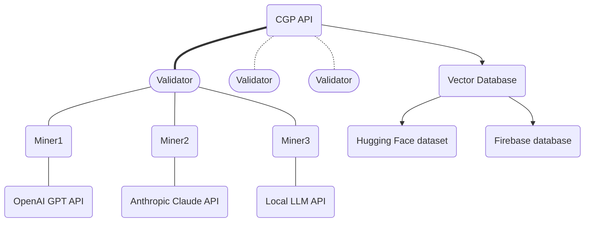
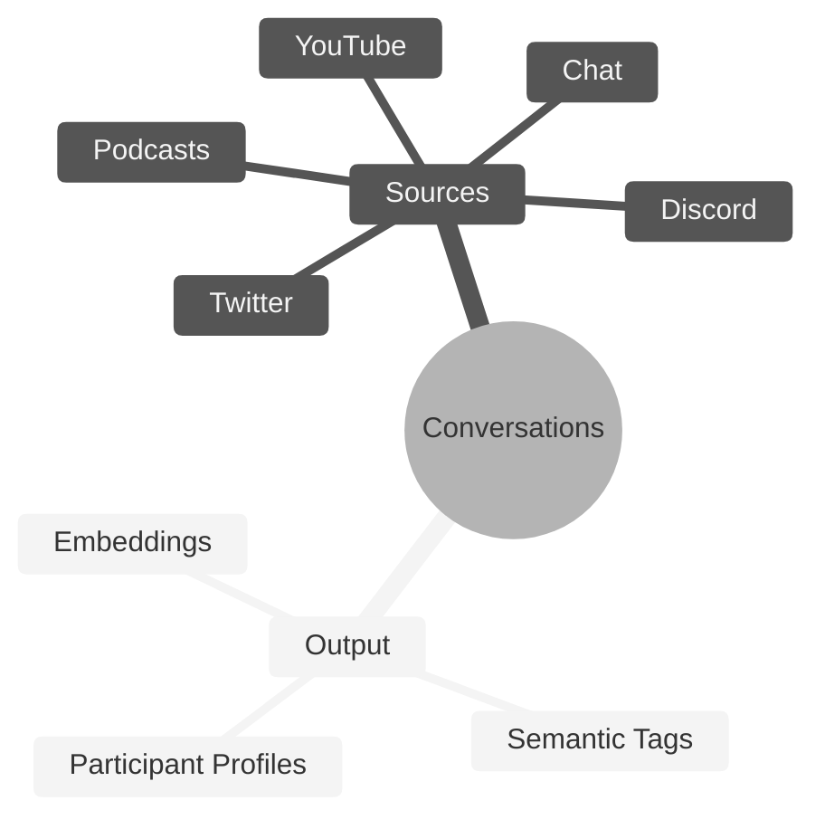

# **Conversation Genome Project** <!-- omit in toc -->
[](https://discord.gg/bittensor)
[](https://opensource.org/licenses/MIT)

---
- [Conversation Genome Project](#conversation-genome-project-overview)
  - [Key Features](#key-features)
- [Quickstart](#quickstart)
  - [Quickstart - Configuration](#quickstart----configuration)
  - [Quickstart - Running the tests](#quickstart----running-the-tests)
- [Conversation Genome Project Overview](#conversation-genome-project-overview)
  - [Benefits](#benefits)
  - [System Design](#system-design)
  - [Rewards and Incentives](#rewards-and-incentives)
- [Setup](#setup)
- [Mining](#mining)
- [Validating](#validating)
- [License](#license)

---

# Introduction to the Conversation Genome Project

The Conversation Genome Project (CGP) is an open-source initiative aimed at enabling personalized conversational AI by providing a comprehensive dataset of indexed and tagged conversations.

If you are new to Bittensor, please checkout the [Bittensor Website](https://bittensor.com/) before proceeding to the setup section.



## Key Features

- Indexing and tagging of billions of conversations across various sources (YouTube, podcasts, etc.)
- Leveraging fractal data mining and conversation windows for efficient processing
- Synthetic participant profiles generated from conversation metadata
- Algorithm to assess conversation quality (relevance, engagement, novelty, coherence, and fluency)
- Open-source dataset for training and fine-tuning conversational AI models
- Incentivized mining and validation system for data contribution and integrity


# Quickstart

The best way to begin to understand the Conversation Genome Project (CGP) is to run the unit tests. These tests are meant to provide verbose output so you can see how the process works.

> NOTE: We recommend your run the unit tests in Debug logging mode so you can see all of the operations, but please **DO NOT run a validator or miner on mainnet with Debug logging mode active**. Info mode logging level is fine for mainnet.


Clone the repo and install the requirements:

```console
xxx git clone https://github.com/afterpartyai/bittensor-afterparty-conversation-genome-subnet.git cgp-subnet
pip install -r requirements.txt
cd cgp-subnet
```

## Quickstart - Configuration

Let's configure your instance and run the tests that verify everything is setup properly.

You'll need to duplicate the dotenv file to setup your own configuration:

```console
cp example.env .env
```

Use your editor to add your Api keys for Weights and Biases and OpenAI.

If you're on a Linux box, the nano editor is usually the easiest:

```console
nano .env
```

Now you will need to setup some configuration variables. Start by copying the example_env file to your own .env:

```console
cp env_example .env
```

Open the .env file in your editor and change these variables to your API keys:

```console
WANDB_API_KEY=some_key
OPENAI_API_KEY=some_key
```

The example file specifies the LLM type as **openai** and the model to use as **gpt-3.5-turbo**, but you can change it depending on your preferences.

## Quickstart - Running the Tests

Once this is setup, let's run the test validator suite, so you can watch the process at work:

```console
python -m pytest -s --disable-warnings  tests/test_validator_lib.py
```

You can follow the output to see the process executes the following flow:

* Starts a validator and three miners
* The validator:
** Obtains a conversation to process from the CGP Api
** Generates tags for the entire conversation
** Breaks the conversation into conversation windows
** Sends the first conversation window to 3 miners
* Each miner:
** Receives the conversation window
** Processes it through the LLM to generate tags, participant profiles, and vector embeddings for each semantic tag
** Returns the metadata to the validor
* The validator:
** Receives the metadata from the miners
** Scores each tag against the ground truth full conversation
** Compares each miner return against other minor returns
** Pushes all the metadata to a local store or the CGP Api

The data generated is explained in detail in the Overview section below. With the Info logging setting, the output should look something like this:

```
- Reserved conversation ID: 1421. Sending to openai LLM... -
- Execute generate_full_convo_metadata for participants ['"SPEAKER_00"', '"SPEAKER_02"'] -
- Found 13 tags in FullConvo -
- Found 38 conversation windows. Sequentially sending to batches of miners -
- Send to conversation 1421 / 0 to miners: [2, 8, 1] -
- RESULTS from miner idx: 0 uid: 2, tags: 11 vector count: 11 -
- RESULTS from miner idx: 1 uid: 8, tags: 4 vector count: 4 -
- RESULTS from miner idx: 2 uid: 1, tags: 10 vector count: 10 -
- Scores num: 11 num of Unique tags: 10 num of full convo tags: 13 -
- Scores num: 4 num of Unique tags: 3 num of full convo tags: 13 -
- Scores num: 10 num of Unique tags: 8 num of full convo tags: 13 -
```


If you have any reported errors in the .env and run again until all tests are finished. These tests run outside the Bittensor network (so no emissions), but they will get a test conversation, process it using your OpenAI key, and report the results. That will make sure the process itself is running properly on your machine.

If everything is working properly, you are ready to run against the testnet. Simply run this file:

```console
bash run_testnet.sh
```

When you're ready to register and run on mainnet, use this file:

```console
bash run_mainnet.sh
```

> NOTE TO DAN: Remove once domain is active

Add a hosts file entry with Gasmask or to the /etc/hosts file that makes the api domain:

```console
54.193.70.198 api.conversationgenome.org
```


# Conversation Genome Project Overview

Conversation Genome Project (CGP) use the Bittensor infrastructure the refine data related to conversations.

## Benefits

- Addresses the lack of personalization in current conversational AI models
- Enables natural and engaging conversations tailored to individual contexts and preferences
- Provides a comprehensive and annotated dataset for conversational AI development
- Encourages open-source community contributions and advancements
- Maintains data integrity through validation and scoring mechanisms

## System Design

- Data stores: Primary source of truth, conversation windows, participant profiles, and vector database
- Validator roles: Pull data, ground conversations, create windows, and score submissions
- Miner roles: Process conversation windows, provide metadata and tags
- Data flow: Ground truth establishment, window creation, miner submissions, scoring, and validation

## Rewards and Incentives

- Miners rewarded for accurate and valuable metadata contributions
- Bell curve distribution of rewards to encourage high-quality submissions
- Cross-referencing and vector space analysis to ensure data integrity
- Boring Index algorithm for assessing conversation quality (not yet used for miner rewards)


## Mining

You can launch your miners via pm2 using the following command.

`pm2 start ./miner/miner.py --interpreter python3 -- --netuid 18 --subtensor.network <LOCAL/FINNEY/TEST> --wallet.name <WALLET NAME> --wallet.hotkey <HOTKEY NAME> --axon.port <PORT>`


## Validating

You can launch your validator via pm2 using the following command.

`pm2 start ./validators/validator.py --interpreter python3 -- --netuid 18 --subtensor.network <LOCAL/FINNEY/TEST> --wallet.name <WALLET NAME> --wallet.hotkey <HOTKEY NAME>`




## License
This repository is licensed under the MIT License.
```text
# The MIT License (MIT)
# Copyright © 2023 Yuma Rao

# Permission is hereby granted, free of charge, to any person obtaining a copy of this software and associated
# documentation files (the “Software”), to deal in the Software without restriction, including without limitation
# the rights to use, copy, modify, merge, publish, distribute, sublicense, and/or sell copies of the Software,
# and to permit persons to whom the Software is furnished to do so, subject to the following conditions:

# The above copyright notice and this permission notice shall be included in all copies or substantial portions of
# the Software.

# THE SOFTWARE IS PROVIDED “AS IS”, WITHOUT WARRANTY OF ANY KIND, EXPRESS OR IMPLIED, INCLUDING BUT NOT LIMITED TO
# THE WARRANTIES OF MERCHANTABILITY, FITNESS FOR A PARTICULAR PURPOSE AND NONINFRINGEMENT. IN NO EVENT SHALL
# THE AUTHORS OR COPYRIGHT HOLDERS BE LIABLE FOR ANY CLAIM, DAMAGES OR OTHER LIABILITY, WHETHER IN AN ACTION
# OF CONTRACT, TORT OR OTHERWISE, ARISING FROM, OUT OF OR IN CONNECTION WITH THE SOFTWARE OR THE USE OR OTHER
# DEALINGS IN THE SOFTWARE.
```
