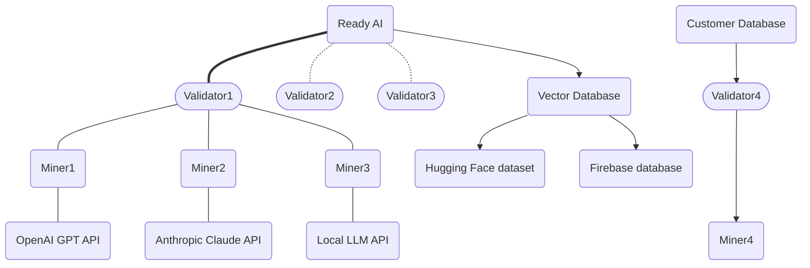
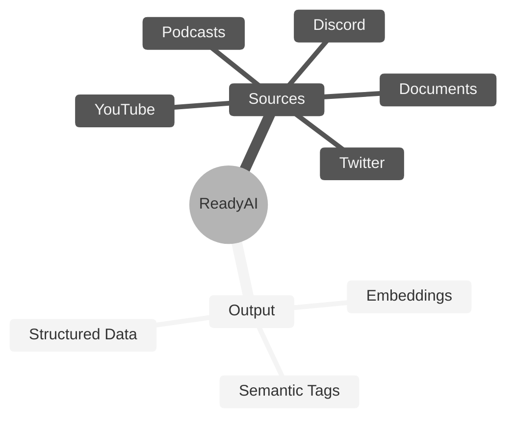

# **ReadyAI** <!-- omit in toc -->
[](https://discord.gg/bittensor)
[](https://opensource.org/licenses/MIT)

---
- [Conversation Genome Project](#conversation-genome-project-overview)
  - [Key Features](#key-features)
  - [Benefits](#Benefits)
  - [System Design](#System-Design)
  - [Rewards and Incentives](#reward-mechanism)
- [Getting Started](#Getting-Started)
  - [Installation & Compute Requirements](#installation--compute-requirements)
  - [Configuration](#configuration)
  - [LLM Selection](#LLM-Selection)
  - [Quickstart - Running the tests](#running-the-tests)
  - [Registration](#Registration)
- [Subnet Roles](#subnet-roles)
  - [Mining](#mining)
  - [Validating](#validating)
- [Helpful Guides](#helpful-guides)
  - [Runpod](#Runpod)
  - [Managing Processes](#managing-processes)
- [License](#license)

---

# Introduction to ReadyAI

ReadyAI is an open-source initiative aimed at provide a low-cost resource-minimal data structuring and semantic tagging pipeline for any individual or business. AI runs on Structured Data. ReadyAI is a low-cost, structured data pipeline to turn your raw data into structured data for your vector databases and AI applications.

If you are new to Bittensor, please checkout the [Bittensor Website](https://bittensor.com/) before proceeding to the setup section.



## Key Features

- Raw Data in, structured AI Ready Data out
- Fractal data mining allows miners to process a wide variety of data sources and create tagged, structured data for the end user’s specific needs
- Validators establish a ground truth by tagging the data in full, create data windows for fractal mining, and score miner submissions
- Scoring is based on a cosine distance calculation between the miner’s window tagged output and the validator’s ground truth tagged output
- ReadyAI has created a low-cost structured data pipeline capitalizing on two key innovations: (1) LLMs are now more accurate and cheaper than human annotators and (2) Distributed compute vs. distributed workers make this infinitely scalable
- Incentivized mining and validation system for data contribution and integrity


# Getting Started

## Installation & Compute Requirements

This repository requires python3.8 or higher. To install the subnet code, simply clone this repository and install the dependencies:

```console
git clone https://github.com/afterpartyai/bittensor-conversation-genome-project.git cgp-subnet
cd cgp-subnet
pip install -r requirements.txt
```

Miners & Validators using an OpenAI API Key will need a CPU with at least 8GB of Ram and 20GB of Disk Space.


## Quickstart Mock Tests

The best way to begin to understand ReadyAI’s data pipeline is to run the unit tests. These tests are meant to provide verbose output so you can see how the process works.

### Configuration

Let's configure your instance and run the tests that verify everything is setup properly.

You'll need to duplicate the dotenv file to setup your own configuration:

```console
cp env.example .env
```

Use your editor to open the .env file, and follow instructions to enter the required API Keys and configurations. **An OpenAI API key is required by both miners and validators***. GPT-4o is the default LLM used for all operations, as it is the cheapest and most performant model accessible via API. Please see [LLM Selection](#LLM-Selection) Below for more information.

**A Weights and Biases Key is required by both miners and validators** as well.

**Please follow all instructions in the .env**

If you're on a Linux box, the nano editor is usually the easiest:

```console
nano .env
```

### LLM Selection

**Please follow all instructions in the .env**

LLM utilization is required in this subnet to annotate raw data. As a miner or validator, GPT-4o is the default LLM used for all operations. If you wish to override this default selection, you can follow override instructions below or in your `.env` file. After completing the steps in [Configuration](#Configuration), you can open up your `.env` file, and view the options. Currently, we offer out-of-the-box configuration for OpenAI, Anthropic, and groq APIs. 

To change the default OpenAI Model used by your miner or validator, you first must uncomment `LLM_TYPE_OVERRIDE=openai` and the select your model using the `OPENAI_MODEL` parameter in the .env:

```
# ____________ OpenAI Configuration: ________________
# OpenAI is the default LLM provider for all miner and validator operations, utilizing GPT-4o.
# To override your OpenAI model choice, uncomment the line below, then proceed to selecting a model. For other override options, see "Select LLM Override" below.
#export LLM_TYPE_OVERRIDE=openai

Enter a model below. See all options at: https://platform.openai.com/docs/models
#export OPENAI_MODEL=gpt-3.5-turbo
#export OPENAI_MODEL=gpt-4-turbo
```

If you wish to use a provider other than OpenAI, you select your LLM Override by uncommenting a line in this section of the .env:

```
# ____________ Select LLM Override________________
...
#export LLM_TYPE_OVERRIDE=groq
#export LLM_TYPE_OVERRIDE=anthropic
```

Please ensure you only have one `LLM_TYPE_OVERRIDE` config parameter uncommented before moving on. Once you have selected the `LLM_TYPE`, follow prompts in the .env file to fill in required fields for your override LLM provider.


### Running the Tests

Once you have finalized your configuration, let's run the test validator suite, so you can watch the process at work. First, set up a fresh virtual environment for running your tests, and install the test requirements. 

Please note that these requirements differ from the production requirements. We recommend creating a separate virtual environment for running tests.

```console
python3 -m venv test_venv
source test_venv/bin/activate
pip install -r requirements_test.txt
```

Once these requirements finish installing, you can run the tests with the following command. 

```console
python -m pytest -s --disable-warnings  tests/test_validator_lib.py
```

You can follow the output to see the process executes the following flow:

- Starts a validator and three miners
- The validator:
  - Obtains a conversation to process from the ReadyAI Api
  - Generates ground truth tags for the raw data
  - Breaks the data into fractal windows
  - Sends the first conversation window to 3 miners
- Each miner:
  - Receives the conversation window
  - Processes it through the LLM to generate tags, annotations, and vector embeddings for each semantic tag
  - Returns the metadata to the validator
- The validator:
  - Receives the metadata from the miners
  - Scores each tag against the full ground truth
  - Pushes all the metadata to a local store or the ReadyAI Api

The data generated is explained in detail in the Overview section below. With the Info logging setting, the output should look something like this:

```
- Reserved conversation ID: 1421. Sending to openai LLM... -
- Execute generate_full_convo_metadata for participants ['"SPEAKER_00"', '"SPEAKER_02"'] -
- Found 13 tags in FullConvo -
- Found 38 conversation windows. Sequentially sending to batches of miners -
- Send to conversation 1421 / 0 to miners: [2, 8, 1] -
- RESULTS from miner idx: 0 uid: 2, tags: 11 vector count: 11 -
- RESULTS from miner idx: 1 uid: 8, tags: 4 vector count: 4 -
- RESULTS from miner idx: 2 uid: 1, tags: 10 vector count: 10 -
- Scores num: 11 num of Unique tags: 10 num of full convo tags: 13 -
- Scores num: 4 num of Unique tags: 3 num of full convo tags: 13 -
- Scores num: 10 num of Unique tags: 8 num of full convo tags: 13 -
```


If you have any reported errors, check your **.env** and Python environment and run again until all tests are finished.

These tests run outside the Bittensor network (so no emissions), but they will get a test conversation, process it using your OpenAI key, and report the results. That will make sure the process itself is running properly on your machine.

If everything is working properly, you are ready to run against the testnet. Please see instructions in the [Registration](#Registration) section to register your hotkey and cold key on our testnet subnet.

Once you are registered, run `nano testnet_start_miner.sh` to edit the start command to the correct wallet information and any additional flags you wish to include, and run this file:

```console
bash testnet_start_miner.sh
```


## Registration
Before mining or validating, you will need a UID, which you can acquire by following documentation on the bittensor website here.

To register on testnet, add the flag `--subtensor.network test` to your registration command, and specify `--netuid 138` which is our testnet subnet uid.

To register on mainnet, you can speciy `--netuid 33` which is our mainnet subnet uid.


# Subnet Roles

## Mining

You can launch your miners on testnet using the following command.

To run with pm2 please see instructions [here](#Running-a-Miner-with-PM2)

If you are running on runpod, please read instructions [here](#Using-Runpod).

```
python3 -m neurons.miner --subtensor.network test --netuid 138 --wallet.name <coldkey name> --wallet.hotkey <hotkey name> --logging.debug --axon.port <port>
```

Once you've registered on on mainnet SN33, you can start your miner with this command:

```
python3 -m neurons.miner --netuid 33 --wallet.name <wallet name> --wallet.hotkey <hotkey name> --axon.port <port>
```


## Validating

To run a validator, you will first need to generate a ReadyAI Conversation Server API Key. Please see the guide [here](docs/generate-validator-api-key.md). If you wish to validate via local datastore, please see the section below on [Validating with a Custom Conversation Server](#validating-with-a-custom-conversation-server)

You can launch your validator on testnet using the following command.

To run with pm2 please see instructions [here](#Running-a-Validator-with-PM2)

If you are running on runpod, please read instructions [here](#Using-Runpod)

```
python3 -m neurons.validator --subtensor.network test --netuid 138 --wallet.name <wallet name> --wallet.hotkey <hotkey name> --logging.debug --axon.port <port>
```

Once you've registered on on mainnet SN33, you can start your miner with this command:

```
python3 -m neurons.validator --netuid 33 --wallet.name <wallet name> --wallet.hotkey <hotkey name> --axon.port <port>
```

## Validating with a Custom Conversation Server

Validators, by default, access the ReadyAI API to retrieve conversations and store results. However, the subnet is designed to be a decentralized “Scale AI” where each validator can sell access to their bandwidth for structuring raw data. The validator can run against any of its own data sources and process custom or even proprietary data.

> Make sure the raw data source is reasonably large. We recommend 50,000 input items at a minimum to prevent miners re-using previous results.

### The Code

In the web/ folder, you will find a sample implementation of a Custom Server setup. You will want to modify this server for your own needs.

The relevant code files in the web/ folder include:

- conversation_data_importer.py -- An example processor that reads the subset of the Facebook conversation data and processes it into the conversations.sqlite data store
- app.py -- A FastAPI-based web server that provides both the read and write endpoints for conversation server.

Data files include:

- facebook-chat-data_2000rows.csv -- A 128 conversation subset of the Facebook conversation data (full data available here: https://www.kaggle.com/datasets/atharvjairath/personachat/data)
- conversations.sqlite -- Database of the processed Facebook data subset
- cgp_tags_YYYY.MM.DD.sqlite -- Daily rotating SQLite data file that holds the tag and vector embeddings results of the validator and miners

Additional files include:

- start_conversation_store.sh -- Convenient bash file to start the server

### Converting the Example Data

Run the converter script:

```console
python conversation_data_importer.py
```

This will process the `facebook-chat-data_2000rows.csv` and insert the conversations into the `conversations.sqlite` database. If you delete the `conversations.sqlite` then it will create a new one and insert the data. You should see progress like this:

```console
22:58:44 Starting data insert of max_rows=1200...
22:58:45 Committing 100 rows. Total count: 100
22:58:45 Insert complete. Total count: 128
```

If you have `sqlite3` installed, you can open the database file and see the inserted data like like:

```console
sqlite3 conversations.sqlite
.tables
SELECT * FROM conversations LIMIT 1;
```

That will show you the tables in the database (only 1 -- `conversations`) and then you will see one of the conversations like this:

```console
1|1|81087215704299650220210175538345752183|0|i like to remodel homes.... !"], [0, ""]], "participant": {"0": {"idx": 0, "guid": 81099766792120672433284180456245507719, "title": "Leslie Brown"}, "1": {"idx": 1, "guid": 81099927942203226444412726509314455175, "title": "Jason Mckenzie MD"}}}|2024-05-29 23:50:33|2024-05-29 23:50:33
```

With the data populated, you're ready to start running the server.

> *Important:* Do not run your validator against this example dataset on mainnet. Please use a custom dataset of at least 50,000 raw data sources at a minimum to prevent miners from re-using previous results. Modify this script to process and load the data from a more robust data store that you've selected.

### Running the Conversation Server locally

To get the server up and running, you can use the bash file:

```console
bash start_conversation_store.sh
```

To run this in pm2, please following installation instructions [here](#pm2-Installation) and then use the command

```console
pm2 start "bash start_conversation_store.sh" --name <process name>
```

Finally, modify the .env of your Validator to point at the web server. Comment out the lines: 

```
#export CGP_API_READ_HOST=https://api.conversations.xyz
#export CGP_API_READ_PORT=443
```

Uncomment the lines: 
```
export CGP_API_READ_HOST=http://localhost
export CGP_API_READ_PORT=8000
```

After these changes, the `DB Read/Write Configuration` section of the .env file should look like this:

```console
# ____________ DB Read/Write Configuration: ____________
# For Validators. Read from api.conversations.xyz
#export CGP_API_READ_HOST=https://api.conversations.xyz
#export CGP_API_READ_PORT=443

# For Validators. Write to db.conversations.xyz
export CGP_API_WRITE_HOST=https://db.conversations.xyz
export CGP_API_WRITE_PORT=443

# For Validators. Commented out by default. Used for local DB Configuration
# See "Validating with a Custom Conversation Server" in the Readme.md for further information
export CGP_API_READ_HOST=http://localhost
export CGP_API_READ_PORT=8000
```

Now you can run the test script and see the data written properly (replace the filename with your database file).

```console
sqlite3 cgp_tags_YYYY.MM.DD.sqlite
.tables
SELECT id,c_guid, mode, llm_type, model FROM cgp_results LIMIT 10;
```

That will provide some of the data inserted into the results table.

# Helpful Guides

## Using Runpod

Runpod is a very helpful resource for easily launching and managing cloud GPU and CPU instances, however, there are several configuration settings that must be implemented both on Runpod and in your start command for the subnet.

### Choosing an Instance

To run the subnet code for ReadyAI, you'll need either a GPU or a CPU, depending on your subnet role and configuration.

Miners & Validators using an OpenAI API Key, you will need a CPU with at least 8GB of Ram and 20GB of Disk Space. Runpod provides basic CPU units of different processing powers.

### Configuring Your Instance

Runpod Instances are dockerized. As a result, there are specific ports configurations needed to be able to run processes over the network.

When you are launching your pod, and have selected your instance, click "Edit Template."

With the editing window open, you adjust your container disk space and/or volume diskspace to match the needs of your neuron, and you can expose additional ports. You will need to expose symmetrical TCP Ports, which requires you to specify non-standard ports >=70000 in the "Expose TCP ports" field. Add however many ports you will need (we recommend at least 2, or more if you want to run additional miners).

Now, you can deploy your instance. Once it is deployed, navigate to your pods, find the instance you just launched, click "Connect" and navigate to the "TCP Port Mappings" tab. here, you should see your Symmetrical TCP Port IDs.

NOTE: Even though the port does not match the original values of 70000 and 70001, two symmetrical port mappings were created. These can be used for bittensor neurons

### Starting Your Neuron

*Important!!* You will need to add one of these ports to your start command for the neuron you are running, using the flag

`--axon.port <port ID>`

Every process will require a unique port, so if you run a second neuron, you will need a second Port ID.

### Running a Subtensor on Runpod

Unfortunately, there is no stable and reliable way to run a local subtensor on a Runpod Instance. You can, however, leverage another cloud provider of your choice to run a Subtensor, and connect to that local subtensor using the `--subtensor.chain_endpoint <your chain endpoint>` flag in your neuron start command. For further information on running a local subtensor, please see the [Bittensor Docs](https://docs.bittensor.com/subtensor-nodes/).

## Managing Processes

While there are many options for managing your processes, we recommend either pm2 or Screen. Please see below for instructions on installing and running pm2

### pm2 Installation

To install Pm2 on your Ubuntu Device, use

```
apt install nodejs npm
npm install -g pm2
```

The basic command structure to run a process in pm2 is below:

```
pm2 start "<your neuron start command here>" --name "<your process name here>"
```

### Running a Miner with PM2

To run a miner with PM2, you can use the following template:

```
pm2 start "python3 -m neurons.miner --netuid 33 --wallet.name default --wallet.hotkey default --logging.debug --axon.port <port>" --name "miner"
```

### Running a Validator with PM2

To run a validator with PM2, you can use the following template:

```
pm2 start "python3 -m neurons.validator --netuid 33 --wallet.name <wallet name> --wallet.hotkey <hotkey name> --axon.port <port>" --name "validator"
```

### Useful PM2 Commands

The following Commands will be useful for management:

```
pm2 list # lists all pm2 processes
pm2 logs <pid> # replace pid with your process ID to view logs
pm2 restart <pid> # restart this pic
pm2 stop <pid> # stops your pid
pm2 del <pid> # deletes your pid
pm2 describe <pid> # prints out metadata on the process
```


# ReadyAI Overview

ReadyAI uses the Bittensor infrastructure to annotate raw data creating structured data, the “oil” required by AI Applications to operate.

## Benefits

- Cost-efficiency: Our validators can generate structured data from any arbitrary raw text data. ReadyAI provides a cost-efficient pipeline for the processing of unstructured data into the valuable digital commodity of structured data.
- Quality: By using advanced language models and built-in quality control via the incentive mechanism arbitrated by validation, we can achieve more consistent, higher-quality annotations compared to crowd workers.
- Speed: AI-powered annotation can process data orders of magnitude faster than human annotators.
- Flexibility: The decentralized nature of our system allows it to rapidly scale and adapt to new task types. Validators can independently sell access to this data generation pipeline to process any type of text-based data (e.g. conversational transcript, corporate documents, web scraped data, etc.)
- Specialized knowledge: Unlike general-purpose crowd workers, our AI models can be fine-tuned on domain-specific data, allowing for high-quality annotations on specialized topics.

## System Design

- Data stores: Primary source of truth, fractal data windows, and vector embedding creation
- Validator roles: Pull data, generates overview metadata for data ground truth, create windows, and score submissions
- Miner roles: Process data windows, provide metadata and annotations
- Data flow: Ground truth establishment, window creation, miner submissions, scoring, and validation

## Reward Mechanism

The reward mechanism for the ReadyAI subnet is designed to incentivize miners to contribute accurate and valuable metadata to the ReadyAI dataset. Three miners are selected by a validator to receive the same Data Window, which is pulled from a larger raw data source. After they generate a set of tags for their assigned window, miners are rewarded based on the quality and relevance of their tags, as evaluated by validators against the set of tags for the full, ground truth data source.

A score for each miner-submitted tag is derived by a cosine distance calculation from the embedding of that tag to the vector neighborhood of the ground truth tags. The set of miner tags is then evaluated in full based on the mean of their top 3 unique tag scores (55% weight), the overall mean score of the set of tags submitted (25% weight), the median score of the tags submitted (10% weight) and their single top score (10% weight).  The weights for each scoring component prioritize the overall goal of the miner– to provide unique and meaningful tags on the corpus of data – while still allowing room for overlap between the miner and ground truth tag sets, which is an indication of a successful miner. There are also a set of penalties that will be assessed if the miner response doesn’t meet specific requirements - such as not providing any tags shared with the ground truth, not providing a minimum number of unique tags, and not providing any tags over a low-score threshold. The tag scoring system informs the weighting and ranking of each server in the subnet.




## License
This repository is licensed under the MIT License.
```text
# The MIT License (MIT)
# Copyright © 2024 Conversation Genome Project

# Permission is hereby granted, free of charge, to any person obtaining a copy of this software and associated
# documentation files (the “Software”), to deal in the Software without restriction, including without limitation
# the rights to use, copy, modify, merge, publish, distribute, sublicense, and/or sell copies of the Software,
# and to permit persons to whom the Software is furnished to do so, subject to the following conditions:

# The above copyright notice and this permission notice shall be included in all copies or substantial portions of
# the Software.

# THE SOFTWARE IS PROVIDED “AS IS”, WITHOUT WARRANTY OF ANY KIND, EXPRESS OR IMPLIED, INCLUDING BUT NOT LIMITED TO
# THE WARRANTIES OF MERCHANTABILITY, FITNESS FOR A PARTICULAR PURPOSE AND NONINFRINGEMENT. IN NO EVENT SHALL
# THE AUTHORS OR COPYRIGHT HOLDERS BE LIABLE FOR ANY CLAIM, DAMAGES OR OTHER LIABILITY, WHETHER IN AN ACTION
# OF CONTRACT, TORT OR OTHERWISE, ARISING FROM, OUT OF OR IN CONNECTION WITH THE SOFTWARE OR THE USE OR OTHER
# DEALINGS IN THE SOFTWARE.
```
